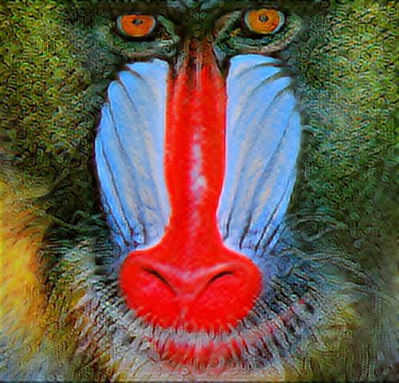

<a id="readme-top"></a>

# SRGAN – Super Resolution Generative Adversarial Network

---
Implementation of SRGAN x4 (Super Resolution GAN) faithful to the [2017 SRGAN paper by Ledig et al](https://arxiv.org/abs/1609.04802). 
My goal is to develop a clean PyTorch project that I can use as a reference in the future.
---

* [![PyTorch][pytorch-shield]][pytorch-url]
* [![Python][python-shield]][python-url]
* [![Dataset][div2k-shield]][div2k-url]
---


<!-- TABLE OF CONTENTS -->
<details>
  <summary>Table of Contents</summary>
  <ol>
    <li>
      <a href="#about_the_project">About The Project</a>
      <ul>
            <li><a href="#changed-parameters">Changed Parameters</a></li>
            <li><a href="#unchanged-parameters">Unchanged Parameters</a></li>
            <li><a href="#results">Results</a></li>
      </ul>
    </li>
    <li>
      <a href="#getting-started">Getting Started</a>
        <ul>
            <li><a href="#project-structure">Project Structure</a></li>
            <li><a href="#installation">Installation</a></li>
            <li><a href="#dataset">Dataset</a></li>
            <li><a href="#training">Training</a></li>
            <li><a href="#inference">Inference</a></li>
        </ul>
    </li>
    <li>
      <a href="#roadmap">Roadmap</a>
    </li>
    <li><a href="#license">License</a></li>
    <li><a href="#acknowledgments">Acknowledgments</a></li>
  </ol>
</details>

---

<!-- ABOUT THE PROJECT -->
## About The Project

---
#### This SRGAN is implemented according to the research paper with minimal changes. Since a lot of work has been done on improving SRGAN since its introduction, some architecture or parameter choices may not be the most optimal according to today's standard. The changes made in the implementation and explicit choices mentioned in the paper are described below.

---
### Changed Parameters
* ``Train dataset: ImageNet Random 350k subset (BRG) -> DIV2K 800 (RGB)``  
    * Changed to accommodate project requirements, models are trained on RGB instead of BRG
* ``Pretrain steps: 1_000_000 -> 2286``
    * Scaled according to dataset size, not final as the model is not learning enough
* ``Train steps: 200_000 -> 257``
    * Same reasoning as above
* ``Learning rate switch step: 100_000 -> 128``
    * Same reasoning as above, uses floor division of train_steps / 2
* ``Mean-opinion-score (MOS) test metric not used``
    * No human participants involved

<p align="right">(<a href="#readme-top">back to top</a>)</p>

---
### Unchanged Parameters

---
#### Data
* ``Scaling factor = 4``
* ``Crop size: 96 x 96 for HR images, 24 x 24 for LR images``
* ``Range of LR images: [0, 1], HR images: [-1, 1]``

---
#### Model Architecture
* ``Number of residual blocks B = 16``
* ``Leaky ReLU α = 0.2``

---

#### Training
* ``Adam β1 = 0.9``
* ``Pretrain learning rate = 0.0001``
* ``Range of LR images: [0, 1], HR images: [-1, 1]``
* ``Content loss: ``
$$
\mathcal{l}_{\text{VGG}/i,j}^{\text{SR}} =
\frac{1}{12.75}
\frac{1}{W_{i,j} H_{i,j}}
\sum_{x=1}^{W_{i,j}} \sum_{y=1}^{H_{i,j}}
\left(
\phi_{i,j}(I^{HR})_{x,y}-
\phi_{i,j}(G_{\theta_G}(I^{LR}))_{x,y}
\right)^2
$$
    * Mean squared loss between the features of reconstructed and reference image, extracted with VGG54 derived from VGG19, 
then scaled with a factor of 1/12.75 to match pixel loss. <br></br>
* ``Adversarial loss:``
$$
\mathcal{l}_{\text{adv}} =
\sum_{n=1}^{N}
\left(-\log D_{\theta_D}(G_{\theta_G}(I_n^{LR}))
\right)
$$
    * Achieved using binary cross entropy with target tensor set to 1 and reduction set to sum

---

#### Test Metrics
All metrics are calculated on the y-channel of center cropped, remove of a 4-pixel wide strip from each border (extracted from SRGAN paper)
* ``Peak Signal-to-Noise Ratio (PSNR)``
* ``Structure Similarity Index (SSIM)``

<p align="right">(<a href="#readme-top">back to top</a>)</p>

---

### Results

---

| (a) Original HR | (b) SRGAN (Paper) | (c) SRGAN (DIV2K) |
|:---------------:|:-----------------:|:-----------------:|
|  |  |  |


The difference in image quality of the SRGAN used in this implementation is attributed to the number of training steps. 
The SRGAN model used is only trained on 25000 pretraining steps and 5000 training steps. 


<p align="right">(<a href="#readme-top">back to top</a>)</p>

---
<!-- GETTING STARTED -->
## Getting Started

---

### Project Structure
```
srgan/
│
├── data/                                   # dataset directory (ignored by Git)
├── src/
│   └── srgan/
│       ├── data/                           # dataset loader 
│       │   └── div2k.py
│       ├── models/                         # SRGAN model components
│       │   ├── discriminator.py           
│       │   ├── feature_extractor.py
│       │   └── generator.py
│       ├── configs.py                      # SRGAN components
│       ├── helpers.py                      # helper functions for loading models, logging etc
│       ├── infer.py
│       ├── pretrain.py                     # pretrains SRGAN generator
│       ├── test.py
│       └── train.py 
├── train.py                                # CLI entrypoints for training, inference and testing
├── test.py
├── infer.py
├── requirements.txt
└── README.md
```

<p align="right">(<a href="#readme-top">back to top</a>)</p>

---
### Installation
```
git clone https://github.com/NotBluemoon/SRGAN.git
cd srgan
pip install -r requirements.txt
```

---
### Dataset
The train dataset [(DIV2K)](https://data.vision.ee.ethz.ch/cvl/DIV2K/) and test dataset [(Set14)](https://www.kaggle.com/datasets/guansuo/set14dataset?resource=download) should be put in the `data/` directory of the project root. The `data/` directory
should be structured as below:
```
data/
├── DIV2K/
│   ├── DIV2K_train_HR/
│   └── DIV2K_train_LR_bicubic/
│       └── 4X/   
└── Set14/
    └── image_SRF_4/

```

<p align="right">(<a href="#readme-top">back to top</a>)</p>

---
### Training
```
python train.py --pretrain_steps 100 --train_steps 50 --checkpoint_interval 25
```

Running only `python train.py` will use the default parameters mentioned above. As the model will take some time to train and 
a satisfactory model has not been trained yet, it is recommended to use the above line to test the project.

An `outputs` directory will be created, containing model checkpoints, log files and the final pretrained generator. The final
SRGAN model will be saved in the `models` directory.
---
#### Training Arguments

| Argument | Default | Description                                                                                                                                                 |
|---------|---------|-------------------------------------------------------------------------------------------------------------------------------------------------------------|
| `--resume` | False | If specified, resume training from exisiting checkpoints. Should only be used in case of an accidental interruption while training as parameters need to remain the same. |
| `--device` | `auto` | `auto` (chooses CUDA if available), `cpu`, or `cuda`.                                                                                                       |
| `--dataset_name` | `DIV2K` | Name of the dataset to be used for training.                                                                                                                |
| `--batch_size` | 16 | Number of training samples per batch.                                                                                                                       |
| `--lr` | 0.0001 | Learning rate for Adam optimizer.                                                                                |
| `--b1` | 0.90 | Adam first moment decay (β₁).                                                                                               |
| `--b2` | 0.999 | Adam second moment decay (β₂).                                                                                                                              |
| `--channels` | 3 | Number of image color channels (RGB).                                                                                                                       |
| `--checkpoint_interval` | 5000 | Number of training steps between saving model checkpoints.                                                                                                  |
| `--pretrain_steps` | 2286 | Number of generator pretraining steps.                                                                                                                      |
| `--train_steps` | 457 | Number of adversarial training steps. Learning rate is halved at the floor half of this value.                                                              |
| `--num_res_blocks` | 16 | Number of residual blocks in the generator network.                                                                                                         |
| `--in_channels` | 3 | Number of input image channels.                                                                                                                             |
---

#### Inference Arguments

| Argument | Default | Description |
|---------|---------|-------------|
| `--in_dir` | None | Path to directory containing LR images to be super-resolved. 
---
### Inference
```
python infer.py --in_dir data/Set14/image_SRF_4
```
Running the command produces x4 super-resolved images from LR images of Set14 using the SRGAN model trained, provided 
that the test dataset and final
SRGAN model exist. The SR images can be found in the `results` directory.

<p align="right">(<a href="#readme-top">back to top</a>)</p>

---

### Test
```
python test.py 
```
Evaluates the image quality of the Set14 SR images with PSNR and SSIM.
For each SR-HR image pair, the PSNR (dB) and SSIM is printed out, along with the mean PSNR and SSIM over the entire dataset.

Metrics are computed on the y-channel of center-cropped and 4-pixel border removal images

---
<!-- ROADMAP -->
## Roadmap
- [ ] Make torch requirements more robust (remove torch cuda)
- [x] Add pretraining logging
- [x] Train a good SRGAN model
- [ ] Add YAML
- [ ] Merge test.py and infer.py
- [ ] Better logging of metrics during training
- [ ] Logging of test metrics (instead of just printing on terminal)
- [ ] Automatic selection of final model based on best metric during training
- [ ] Generalise functions
- [ ] Clean up project
  
<p align="right">(<a href="#readme-top">back to top</a>)</p>

---

<!-- LICENSE -->
## License

This project is licensed under the MIT License. See [LICENSE](LICENSE) for more information.

<p align="right">(<a href="#readme-top">back to top</a>)</p>

---

<!-- ACKNOWLEDGMENTS -->
## Acknowledgments
Resources that are used or referenced in the development of this project.
* [Photo-Realistic Single Image Super-Resolution Using a Generative Adversarial Network](https://arxiv.org/abs/1609.04802)
* [PyTorch-GAN GitHub Repo](https://github.com/eriklindernoren/PyTorch-GAN/tree/master)
* [DIV2K Dataset](https://github.com/eriklindernoren/PyTorch-GAN/tree/master)
* [Best-README-Template Github Repo](https://github.com/othneildrew/Best-README-Template/tree/main)
* [Conventional Commits](https://www.conventionalcommits.org/en/v1.0.0/)

<p align="right">(<a href="#readme-top">back to top</a>)</p>


<!-- MARKDOWN LINKS & IMAGES -->
[python-shield]: https://img.shields.io/badge/Language-Python-3776AB?logo=python&logoColor=white
[python-url]: https://www.python.org/
[pytorch-shield]: https://img.shields.io/badge/Framework-PyTorch-ee4c2c?logo=pytorch&logoColor=white
[pytorch-url]: https://pytorch.org/
[div2k-shield]: https://img.shields.io/badge/Dataset-DIV2K-blue
[div2k-url]: https://data.vision.ee.ethz.ch/cvl/DIV2K/